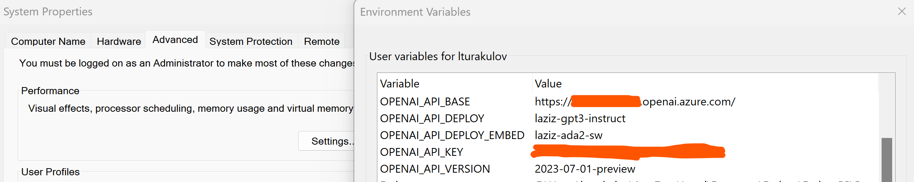

# Question-answering solutions, powered by the capabilities of Azure OpenAI, LangChain and Milvus.

In this repo I'll demo how to combine and utilise 3 great technologies:
- [Azure OpenAI](https://learn.microsoft.com/en-us/azure/ai-services/openai/overview) for embedding and reasoning;
- [LangChain](https://python.langchain.com/docs/get_started/introduction) for the flow design;
- [Milvus](https://milvus.io/docs/overview.md) for the vector search.

## Table of contents:
- [Step 1 - Starting standalone Milvus instance with Docker](https://github.com/LazaUK/AOAI-LangChain-Milvus/tree/main#step-1---starting-standalone-milvus-instance-with-docker)
- [Step 2 - Setting up local environment](https://github.com/LazaUK/AOAI-LangChain-Milvus/tree/main#step-2---setting-up-local-environment)
- [Step 3 - Preparing data](https://github.com/LazaUK/AOAI-LangChain-Milvus/tree/main#step-3---preparing-data)
- [Step 4 - Question answering](https://github.com/LazaUK/AOAI-LangChain-Milvus/tree/main#step-4---question-answering)

## Step 1 - Starting standalone Milvus instance with Docker

1. Download the latest version of [docker-compose.yml](https://github.com/milvus-io/milvus/releases/download/v2.3.2/milvus-standalone-docker-compose.yml) YAML file;
2. Start the Milvus containers with the Docker Compose command:
```
docker-compose up -d
```
3. You should get confirmation that the network has been created and 3 containers started:
   
4. You can also verify containers' running status with either of these commands:
```
docker compose ps
docker ps
```
> **Note:** If you want to clean-up resources, you can stop Milvus containers with ```docker compose down``` command, delete content of the created *volumes* directory and remove relevant Docker images from your machine.

## Step 2 - Setting up local environment

1. Install required Python packages for Azure OpenAI, LangChain and Milvus, by using pip command and provided requirements.txt file.
```
pip install -r requirements.txt
```
2. Create environment variables OPENAI_API_BASE, OPENAI_API_DEPLOY, OPENAI_API_DEPLOY_EMBED, OPENAI_API_KEY and OPENAI_API_VERSION, and assign values of your Azure OpenAI deployment settings.
   

## Step 3 - Preparing data

> **Note:** Steps 3 and 4 are implemented in provided Jupyter notebook.
1. Use LangChain PDF document loader and split into chunks. By default, LangChain uses RecursiveCharacterTextSplitter.
``` Python
loader = PyPDFLoader("data/NorthwindHealthPlus_BenefitsDetails.pdf")
pages = loader.load_and_split()
```
2. Initiate OpenAIEmbeddings class with endpoint details of your Azure OpenAI embedding model. At the time of writing, endpoint of text-embedding-ada-002 was supporting up to **16** inputs per batch.
> **Note:** LangChain Python package wrongly calls batch size parameter as "chunk_size", while JavaScript package correcty calls it batchSize. See reference URLs in Jupyter notebook.
``` Python
embeddings = OpenAIEmbeddings(engine=ADA_deployment, chunk_size=16);
```
3. Convert chunked text into vector embeddings and upload them into Milvus vector store, created in Step 1 above.
``` Python
vector_store = Milvus.from_documents(
    pages,
    embedding=embeddings,
    collection_name="YOUR_COLLECTION_NAME",
    connection_args={"host": MILVUS_HOST, "port": MILVUS_PORT}
)
```
4. If you want to run your queries against existing Milvus collection, you can access it any time by direct initialisation of the Milvus vector store.
``` Python
vector_store = Milvus(
    embedding_function=embeddings,    
    collection_name="YOUR_COLLECTION_NAME",
    connection_args={"host": MILVUS_HOST, "port": MILVUS_PORT}
)
```

## Step 4 - Question answering

1. To run simple similarity search you can call relevant LangChain function. Vector store will return document chunk with a vector close to your query's one.
``` Python
docs = vector_store.similarity_search(query)
```
You can re-shape the response structure, if required, to retrieve content + source details, and produce something like this:
``` JSON
Original source document: data/NorthwindHealthPlus_BenefitsDetails.pdf
Original source document page: 93
--------------------------------------
The Northwind Health Plus plan is a group health plan that is sponsored by Contoso and 
administered by Northwind Health. As a participant in this group plan, you will have access 
to a wide range of health benefits and services. 
```
2.  However, we can do better. Instead of getting back the whole document chunk, more elegant solutuion is to chain the earlier output of similarity search with an Azure OpenAI GPT model and summarise it.
``` Python
chain = load_qa_with_sources_chain(
    llm=AzureOpenAI(engine=GPT_deployment),
    chain_type="map_reduce",
    return_intermediate_steps=True
)
response = chain(
    {"input_documents": docs, "question": query},
    return_only_outputs=True
)
```
3. Another option would be to replace the above two steps with a single Retrieval-Augmented Generation (RAG) chain.
``` Python
rag_chain = RetrievalQA.from_chain_type(
    llm=AzureOpenAI(engine=GPT_deployment),
    retriever=vector_store.as_retriever()
)
```
