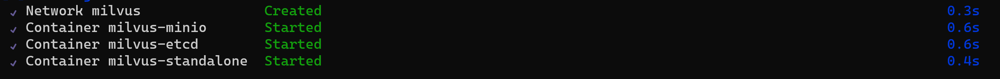

# Question-answering solutions, powered by the capabilities of Azure OpenAI, LangChain and Milvus.

In this repo I'll demo how to combine and utilise 3 great technologies:
- [Azure OpenAI](https://learn.microsoft.com/en-us/azure/ai-services/openai/overview) for embedding and reasoning;
- [LangChain](https://python.langchain.com/docs/get_started/introduction) for the flow design;
- [Milvus](https://milvus.io/docs/overview.md) for the vector search.

## Table of contents:
- [Step 1 - Starting standalone Milvus instance with Docker](https://github.com/LazaUK/AOAI-LangChain-Milvus#step-1---start-standalone-milvus-instance-with-docker)
- [Step 2 - Setting up local environment]
- [Step 3 - Preparing data]
- [Step 4 - Question answering]

## Step 1 - Starting standalone Milvus instance with Docker

1. Download the latest version of [docker-compose.yml](https://github.com/milvus-io/milvus/releases/download/v2.3.2/milvus-standalone-docker-compose.yml) YAML file;
2. Start the Milvus containers with the Docker Compose command:
```
docker-compose up -d
```
3. You should get confirmation that the network has been setup and 3 constainers started:
   
4. You can also verify containers' running status with either of these commands:
```
docker compose ps
docker ps
```
> **Note:** If you want to clean-up resources, you can stop Milvus containers with ```sudo docker compose down``` command, delete content of the *volumes* directory and remove relevant Docker images from your machine.

## Step 2 - Setting up local environment

## Step 3 - Preparing data

## Step 4 - Question answering
